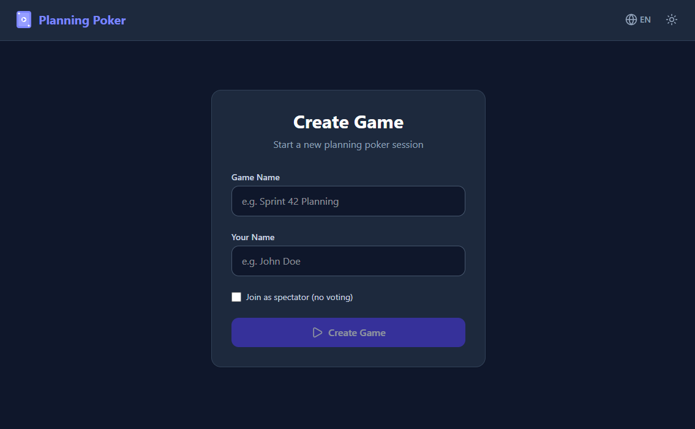

<div align="center">
  
  #  Planning Poker Realtime

   Um aplicativo moderno e elegante de Planning Poker (Scrum Poker) para estimativas ágeis em tempo real. Desenvolvido para facilitar o dia a dia de equipes de desenvolvimento distribuídas, garantindo que as estimativas sejam feitas de forma rápida, justa e dinâmica.

  🚀 **Acesse agora:** [https://planningpokerdev.vercel.app/](https://planningpokerdev.vercel.app/)
</div>

---

## 📸 Preview

<p align="center">
  
</p>

---

## ✨ Características

-   **Tempo Real:** Sincronização instantânea entre todos os participantes usando Supabase Realtime.
-   **Multilíngue:** Suporte completo para Português (PT) e Inglês (EN).
-   **Tema Dark/Light:** Interface adaptável que respeita a preferência do sistema ou ajuste manual.
-   **Design Premium:** Interface moderna construída com Tailwind CSS e animações suaves via Framer Motion.
-   **Totalmente Serverless:** Arquitetura eficiente rodando na Vercel com infraestrutura Supabase.

## 🛠️ Tecnologias Utilizadas

-   **Frontend:** [React 19](https://react.dev/) + [Vite](https://vitejs.dev/)
-   **Estilização:** [Tailwind CSS 4](https://tailwindcss.com/)
-   **Backend & Tempo Real:** [Supabase](https://supabase.com/) (Channels, Presence, Broadcast)
-   **Animações:** [Motion](https://motion.dev/)
-   **Ícones:** [Lucide React](https://lucide.dev/)
-   **Internacionalização:** [i18next](https://www.i18next.com/)

## 🚀 Começando

### Pré-requisitos

-   Node.js (v18+)
-   NPM ou Yarn

### Instalação

1. Clone o repositório:
   ```bash
   git clone https://github.com/ivancmc/plannigpoker.git
   cd plannigpoker
   ```

2. Instale as dependências:
   ```bash
   npm install
   ```

3. Configure as variáveis de ambiente:
   Crie um arquivo `.env` na raiz do projeto com suas chaves do Supabase:
   ```env
   VITE_SUPABASE_URL=seu_url_do_supabase
   VITE_SUPABASE_ANON_KEY=sua_chave_anonima_do_supabase
   ```

4. Inicie o servidor de desenvolvimento:
   ```bash
   npm run dev
   ```

## 📦 Deployment

O projeto está configurado para ser implantado na **Vercel**.

1. Conecte seu repositório GitHub à Vercel.
2. Configure as variáveis de ambiente (`VITE_SUPABASE_URL` e `VITE_SUPABASE_ANON_KEY`) no painel da Vercel.
3. O build e deploy serão automáticos.

---

Desenvolvido por [ivancmc](https://github.com/ivancmc) usando Google AI Studio e Antigravity.
